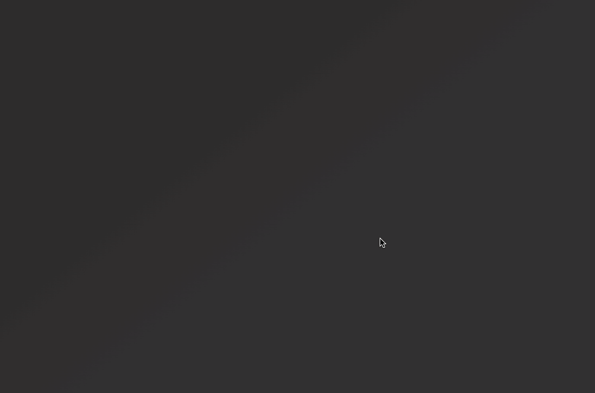
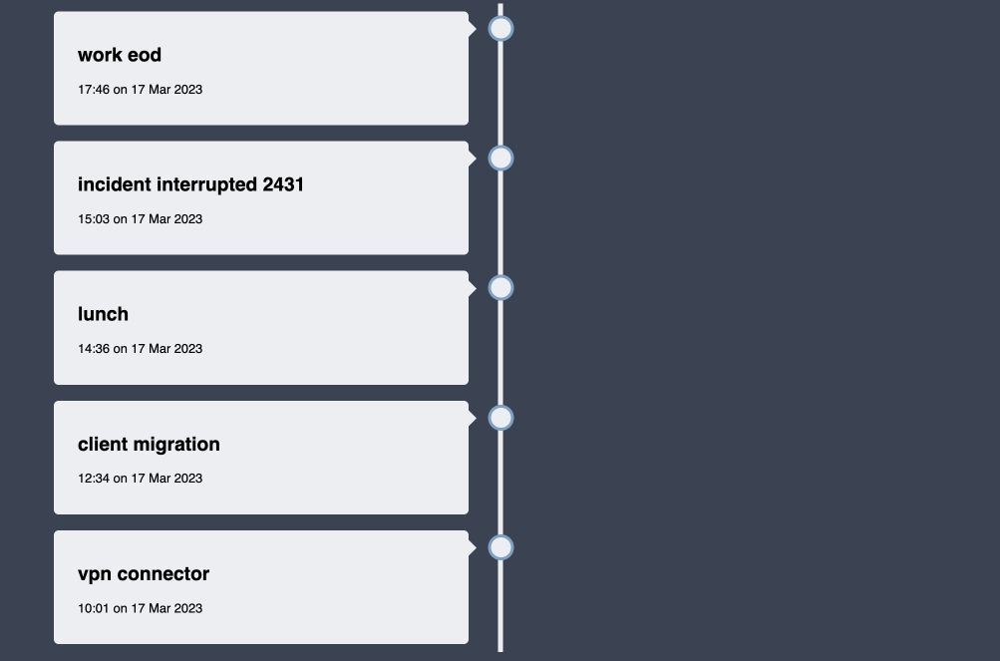

## Low-overhead time recorder

Least invasive, csv based, linear time recorder that doesn't keep your data hostage. 

### Demo with a few entries and visualisation

<p align="left">
  
</p>

### Motivation

In my daily work I often struggle with frequent context switches and stopping to write documentation. This tool helps me alleviate both of those problems.

`tsr` lets me easily mark the context switches, making them much more consious and observable. Having a written record helps me measure the real scale of the problem and pinpoint productivity sinks.

`tsn` allows me to write notes as I go. This at least gives me a skeleton documentation once a feature is done, minimising the effort needed to write a proper document later.

I tried a few other tools over the years, but the number of features they offer often distracted me from using it efficiently, making time tracking an effort on its own.

While `tsr` may not have an extensive list of features, it has proven to be effective for my needs, and I believe it may also benefit others in similar situations.

### Details and usage

This tool uses a simple two-column csv format for storing records

```
datetime,tags delimited by space
```

Each record should mark a newly started activity, that way context switches are much more consious and observable.

The tag has a default value of 'next' to minimise the time required to operate the tool, you can edit the records manually later.

```
<launcher-hotkey> 'tsr' <enter>
```

Adding new activities with tags is also quite simple

```
<launcher-hotkey> tsr <tab> vpn connector <enter>
<launcher-hotkey> tsr <tab> client migration <enter>
<launcher-hotkey> tsr <tab> lunch <enter>
<launcher-hotkey> tsr <tab> incident interrupted 2431 <enter>
<launcher-hotkey> tsr <tab> work eod <enter>
```

This would result in creating a file `record.csv` with the following content:
```
2023-03-17 10:01:55.000000,vpn connector
2023-03-17 12:34:00.000000,client migration
2023-03-17 14:36:00.000000,lunch
2023-03-17 15:03:55.000000,incident interrupted 2431
2023-03-17 17:46:57.000000,work eod
```

Based on the output, you can create custom reports and do your visualisation wizardry

## Available options

### TSR - Record

Creates a new timestamped entry in the `records.csv` file.

<p align="left">
  
</p>

### TSN - Note

Creates a timestamped note in the `notes.csv` file. 

Notes are attached to the record they correspond to in the `tsv` view.

<p align="left">
  
</p>

### TSL - Latest

Displays the latest entry and its duration.

<p align="left">
  
</p>

### TSV - View

Builds a self-contained offline HTML page that displays entries on a timeline.

Once built, you can use the html file on its own as it doesn't have any external dependencies.

Since this is statically built, the page will not self-update with new entries. 
You'll have to use `tsv` each time you want to see the up-to-date timeline view.

This does not start a webserver of any kind, it's a completely static HTML page. 

<p align="left">
  
</p>

### TSE - Edit

Simply opens Finder in the records directory so you can edit or lookup files manually

<p align="left">
  
</p>

## Installation

Installing the extension is as simple as pointing Raycast at the directory where the scripts are.

You can clone this repository or download it as a zip, then point Raycast Extensions at the `raycast` directory where you downloaded this repository.

<p align="left">
  
</p>
