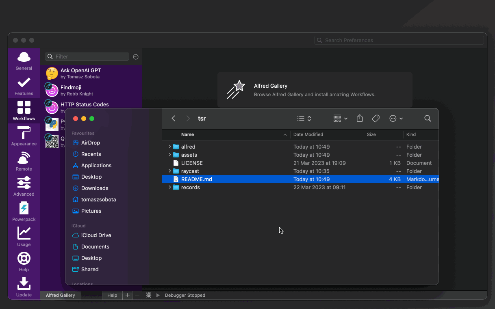

### Installation

Installing the workflow is as simple as double clicking the `Timestamp Record.alfredworkflow` package here in this directory and hitting "Install" once in Alfred's installation window.

  

